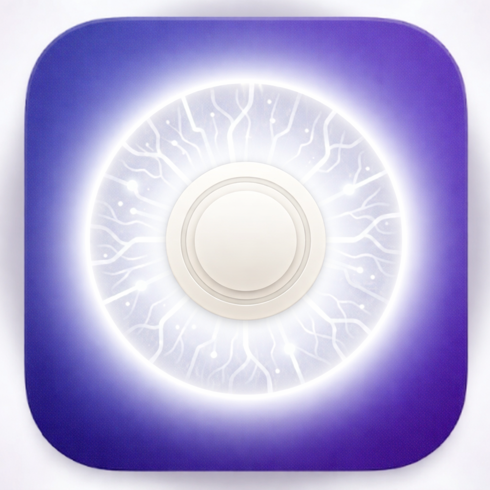

<div align="center"></div>

# byakugan

日向一族の血継限界「白眼」のごとく、byakugan は開発環境の全てを一つの画面に映し出す。

発動中は、起動中の全 Claude Code プロセスをほぼ 360 度の視野でリアルタイム監視。
チャクラの流れ（トークン使用量）から、各プロセスの内部状態（タスク・開いているファイル・CPU / メモリ）まで透視し、
何 km も先の情報（複数リポジトリ・ブランチ・PR）をも手元の一画面に集める。
点穴（Docker コンテナの状態）さえも見逃さない。

カードをクリックすれば、対応する VSCode / Cursor ウィンドウへ即ジャンプ。
**macOS 専用。**

[English README](./README.md)

## ターゲット

- **複数ディスプレイ**で開発している人
- **VSCode や Cursor** をメインの IDE として使用しており、**複数ウィンドウを同時に起動**し、それぞれのターミナルで Claude Code を動かしている人

## スクリーンショット

**実際の使用例** — 同一リポジトリの worktree をグループ表示:


**デモモード** — すべての情報をダミーデータに置換（Demo ボタンでトグル）:


## 機能

### カード表示
各 Claude Code プロセスがカードとして表示され、以下の情報を確認できます:
- **リポジトリ名** + **git ブランチ名**（メインタイトル）
- **PR タイトル** + **PR リンク**と PR 番号（例: `PR:1234 Fix authentication bug`）
- **Docker コンテナ**の状態（`🐳 3/4 api db redis`）
- 右上に**エディタアイコン**（VSCode / Cursor）
- 緑の枠線で **working / idle 状態**を表示
- `···` クリックで**統計パネル**（CPU・メモリ・起動時間・PID）をトグル

### レイアウト
- **worktree グループ化**: 同一リポジトリの worktree をまとめてグループ表示。worktree 数の多い順に上から並ぶ
- **最近開いたプロジェクト**: Claude プロセスのないエディタウィンドウを下部にまとめて表示

### ヘッダー
- **トークン使用量**: 5 時間・週次の Claude API 使用状況（例: `5h:32% (2h5m)[reset:02:00] wk:35%(2d13h)`）
- **Working / Idle カウント**: アクティブ・待機中のエージェント数をリアルタイム表示
- **デモモード**: スクショ撮影用にプロジェクト情報をダミーデータに置換

### その他
- **ワンクリック IDE フォーカス**: カードをクリックで対応する VSCode / Cursor ウィンドウが即座にアクティブに
- **ダーク / ライトテーマ**: システム設定に応じて自動切り替え
- **SSE ベースのリアルタイム更新**: 2 秒ごとにデータを更新
- **ホットリロード**: 開発中は `public/` 配下のファイル変更を自動検出してリロード

## 前提条件

- **macOS**（`ps`、`lsof`、`osascript` を使用）
- **Node.js 18+**
- **GitHub CLI** (`gh`) — PR リンク取得用
- **Git** — ブランチ情報取得用

## インストール

```bash
git clone https://github.com/litencatt/byakugan.git
cd byakugan
npm install
```

## 使用方法

### 開発モード（ファイル変更で自動リロード）

```bash
npm run dev
```

ブラウザで http://localhost:3000 を開きます。

ポートを変更する場合:

```bash
PORT=8080 npm run dev
```

### 本番モード

```bash
npm run build
npm start
```

## 技術スタック

- **バックエンド**: Node.js + TypeScript + Express
- **フロントエンド**: Vanilla JavaScript（フレームワークなし）
- **通信**: Server-Sent Events（リアルタイムプッシュ）
- **プロセス情報取得**: `ps`、`lsof`、`git`、`gh` CLI
- **ウィンドウ制御**: macOS `osascript` + `open -a`

## 開発スクリプト

```bash
npm run build      # TypeScript をコンパイル
npm run dev        # 開発モード（tsx watch + ホットリロード）
npm start          # 本番モード（ビルド後）
npm test           # テスト実行
npm run test:watch # テスト監視モード
```

## 環境変数

| 変数名 | デフォルト | 説明 |
| --- | --- | --- |
| `PORT` | `3000` | HTTP サーバーポート |
| `BYAKUGAN_POLL_INTERVAL_MS` | `2000` | SSE 更新間隔 & プロセスデータキャッシュ TTL (ms) |
| `BYAKUGAN_OAUTH_FETCH` | `true` | `false` で OAuth 使用量 API を無効化（429 頻発時などに有用） |
| `BYAKUGAN_OAUTH_CACHE_TTL_MS` | `300000` | OAuth 成功レスポンスのキャッシュ時間 (ms) |
| `BYAKUGAN_5H_LIMIT` | — | 5 時間の出力トークン上限（近似 % 表示用） |
| `BYAKUGAN_WEEKLY_LIMIT` | — | 週次の出力トークン上限（近似 % 表示用） |
| `BYAKUGAN_USAGE_CACHE_PATH` | `~/.claude/plugins/byakugan/.usage-cache.json` | OAuth 使用量 API レスポンスのディスクキャッシュ保存先（サーバー再起動後も維持） |

## API リファレンス

### `GET /events`

SSE ストリーム — 2 秒ごとにダッシュボード全データをプッシュ配信。

### `GET /api/processes`

実行中の Claude Code プロセスデータのスナップショットを返します。

**レスポンス例:**
```json
{
  "processes": [
    {
      "pid": 12345,
      "projectName": "my-project",
      "projectDir": "/Users/user/projects/my-project",
      "status": "working",
      "cpuPercent": 15.2,
      "memPercent": 8.5,
      "currentTask": "新機能の実装",
      "gitBranch": "feat/new-feature",
      "gitCommonDir": "/Users/user/projects/my-project/.git",
      "modelName": "claude-sonnet-4-6",
      "prUrl": "https://github.com/user/repo/pull/123",
      "openFiles": ["src/server.ts", "src/types.ts"],
      "editorApp": "vscode",
      "containers": [
        { "service": "api", "name": "api-1", "state": "running", "status": "Up 2 hours" }
      ]
    }
  ],
  "editorWindows": [],
  "totalWorking": 1,
  "totalIdle": 2,
  "usage": {
    "totalInputTokens": 120000,
    "totalOutputTokens": 45000,
    "fiveHourPercent": 32,
    "weeklyPercent": 35,
    "fiveHourResetsAt": "2025-01-15T02:00:00Z",
    "weeklyResetsAt": "2025-01-20T00:00:00Z"
  },
  "collectedAt": "2025-01-15T10:30:45.123Z"
}
```

### `POST /api/focus`

Claude プロセスに対応するエディタウィンドウにフォーカスします。

```json
{ "pid": 12345 }
```

### `POST /api/focus-editor`

Claude プロセスのないエディタウィンドウにフォーカスします。

```json
{ "projectDir": "/Users/user/projects/my-project", "app": "vscode" }
```

## トラブルシューティング

### "No Claude processes found" と表示される

Claude Code が起動していることを確認してください:
```bash
ps aux | grep claude
```

### PR リンクが表示されない

- GitHub CLI (`gh`) がインストール・認証済みであることを確認
- 現在のブランチが `main` または `master` 以外であることを確認

### VSCode / Cursor のフォーカスが効かない

- エディタが起動していることを確認
- システム設定 → プライバシーとセキュリティ → アクセシビリティ で権限を確認

## ライセンス

MIT

## 貢献

Issue や Pull Request は大歓迎です！
