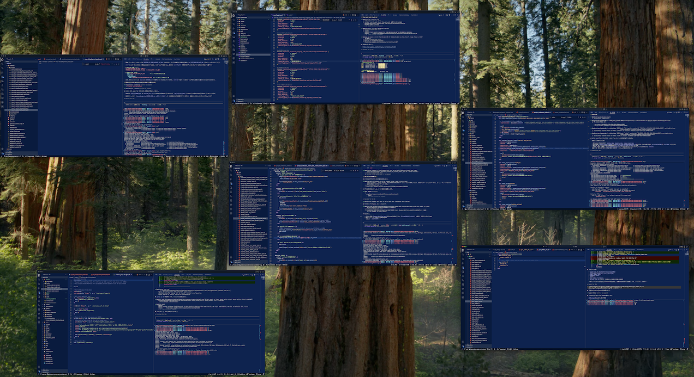
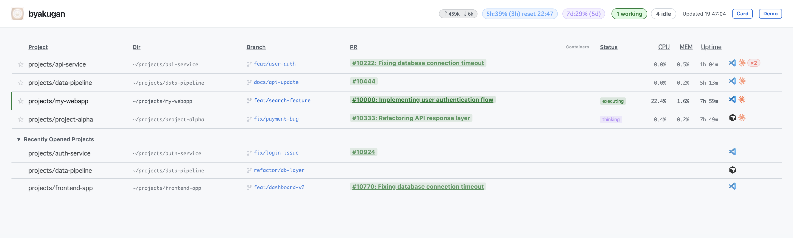

# byakugan

Like the Byakugan — the Hyūga clan's kekkei genkai — byakugan sees through your entire development environment from a single screen.

While active, it monitors all running Claude Code processes in near-360° real-time vision.
From chakra flow (token usage) to each process's inner state (tasks, open files, CPU/memory),
to intelligence from kilometers away (multiple repos, branches, PRs) — all gathered on one screen.
Even tenketsu (Docker container status) never escapes its sight.

Click any card to instantly jump to the corresponding VSCode / Cursor window.
**macOS only.**

[日本語版 README はこちら](./README.ja.md)

## Target

- Developers working with **multiple displays**
- Developers who use **VSCode or Cursor** as their primary IDE, with **multiple instances open simultaneously**, each running a Claude Code agent in its own terminal

## Screenshots

**Real usage** — multiple worktrees of the same repository grouped together:



**Demo mode** — all sensitive info replaced with dummy data (toggle with the Demo button):



## Features

### Card display
Each Claude Code process appears as a card showing:
- **Repository name** + **git branch** (main title)
- **PR title** + **PR link** with PR number (e.g. `PR:1234 Fix authentication bug`)
- **Active model** (Sonnet, Opus, etc.)
- **Current task** description from session data
- **Open files** list
- **Docker containers** status (`🐳 3/4 api db redis`)
- **Editor icon** (VSCode / Cursor) in top-right corner
- **Working/idle status** via green border highlight
- **Stats panel** (CPU, memory, uptime, PID) — toggle with `···`

### Layout
- **Worktree grouping**: Multiple worktrees of the same repository are grouped under a repo header, sorted by worktree count (most active repos first)
- **Recently opened projects**: Editor windows without an active Claude process shown in a separate section at the bottom

### Header
- **Token usage**: 5-hour and weekly Claude API usage (e.g. `5h:32% (2h5m)[reset:02:00] wk:35%(2d13h)`)
- **Working/idle counts**: Live count of active and idle agents
- **Demo mode**: Replace all project info with dummy data for screenshots

### Other
- **One-click IDE focus**: Click a card to instantly activate the corresponding VSCode / Cursor window
- **Dark / light theme**: Follows system preference
- **SSE-based live updates**: Refreshes every 2 seconds
- **Hot reload**: Auto-reloads the UI when files in `public/` change during development

## Prerequisites

- **macOS** (uses `ps`, `lsof`, `osascript`)
- **Node.js 18+**
- **GitHub CLI** (`gh`) — for PR link detection
- **Git** — for branch info

## Installation

```bash
git clone https://github.com/litencatt/byakugan.git
cd byakugan
npm install
```

## Usage

### Development mode (auto-reload on file change)

```bash
npm run dev
```

Open http://localhost:3000 in your browser.

### Production mode

```bash
npm run build
npm start
```

## Project Structure

```
byakugan/
├── src/
│   ├── server.ts                    # Express server, SSE, REST API
│   ├── processCollector.ts          # Orchestrates data collection
│   ├── types.ts                     # TypeScript types
│   ├── collectors/
│   │   ├── sessionCollector.ts      # Claude session data & rate limit usage
│   │   ├── gitCollector.ts          # Git branch, common dir, PR URL
│   │   ├── dockerCollector.ts       # Docker Compose container status
│   │   └── editorCollector.ts       # VSCode / Cursor open windows
│   └── utils/
│       └── processUtils.ts          # Shared utility functions
├── public/
│   ├── index.html                   # Dashboard HTML
│   ├── app.js                       # Frontend (SSE client, rendering, demo mode)
│   ├── style.css                    # Dark/light theme styles
│   └── [icons].svg                  # Claude, VSCode, Cursor, git-branch icons
├── docs/
│   ├── screenshot.png               # Real usage screenshot
│   └── demo.png                     # Demo mode screenshot
├── package.json
└── tsconfig.json
```

## Tech Stack

- **Backend**: Node.js + TypeScript + Express
- **Frontend**: Vanilla JavaScript (SSE client, no framework)
- **Communication**: Server-Sent Events (real-time push)
- **Process info**: `ps`, `lsof`, `git`, `gh` CLI
- **Window control**: macOS `osascript` + `open -a`

## Scripts

```bash
npm run build      # Compile TypeScript
npm run dev        # Development mode (tsx watch + hot reload)
npm start          # Production mode (after build)
npm test           # Run tests
npm run test:watch # Watch mode tests
```

## API Reference

### `GET /events`

SSE stream — pushes full dashboard data every 2 seconds.

### `GET /api/processes`

Returns a snapshot of all running Claude Code processes.

**Response example:**
```json
{
  "processes": [
    {
      "pid": 12345,
      "projectName": "my-project",
      "projectDir": "/Users/user/projects/my-project",
      "status": "working",
      "cpuPercent": 15.2,
      "memPercent": 8.5,
      "currentTask": "Implement new feature for dashboard",
      "gitBranch": "feat/new-feature",
      "gitCommonDir": "/Users/user/projects/my-project/.git",
      "modelName": "claude-sonnet-4-6",
      "prUrl": "https://github.com/user/repo/pull/123",
      "openFiles": ["src/server.ts", "src/types.ts"],
      "editorApp": "vscode",
      "containers": [
        { "service": "api", "name": "api-1", "state": "running", "status": "Up 2 hours" }
      ]
    }
  ],
  "editorWindows": [],
  "totalWorking": 1,
  "totalIdle": 2,
  "usage": {
    "totalInputTokens": 120000,
    "totalOutputTokens": 45000,
    "fiveHourPercent": 32,
    "weeklyPercent": 35,
    "fiveHourResetsAt": "2025-01-15T02:00:00Z",
    "weeklyResetsAt": "2025-01-20T00:00:00Z"
  },
  "collectedAt": "2025-01-15T10:30:45.123Z"
}
```

### `POST /api/focus`

Focus the editor window associated with a Claude process.

```json
{ "pid": 12345 }
```

### `POST /api/focus-editor`

Focus an editor window not associated with a Claude process.

```json
{ "projectDir": "/Users/user/projects/my-project", "app": "vscode" }
```

## Troubleshooting

### "No Claude processes found"

Make sure Claude Code is running:
```bash
ps aux | grep claude
```

### PR link not showing

- Ensure GitHub CLI (`gh`) is installed and authenticated
- The current branch must not be `main` or `master`

### VSCode / Cursor focus not working

- Make sure the editor is running
- Check macOS accessibility permissions in System Settings → Privacy & Security → Accessibility

## License

MIT

## Contributing

Issues and pull requests are welcome!
